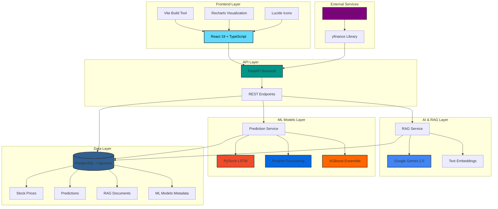

# 📈 StockRAG - AI-Powered Stock Analysis Platform

<div align="center">

**An intelligent stock analysis platform combining RAG (Retrieval-Augmented Generation) with predictive ML models for data-driven investment insights.**

[](https://www.python.org/)
[](https://fastapi.tiangolo.com/)
[](https://react.dev/)
[](https://www.typescriptlang.org/)
[](https://www.postgresql.org/)
[](https://pytorch.org/)

</div>

---

## 🌟 Features

### 💬 AI Financial Assistant
- **Natural Language Queries**: Ask questions about stocks in plain English
- **RAG-Powered Responses**: Retrieves relevant historical data using vector embeddings
- **Context-Aware**: Understands both historical and predictive queries
- **Powered by Google Gemini 2.0 Flash**: State-of-the-art LLM for financial analysis

### 📊 Predictive Analytics
- **Ensemble ML Models**: Combines LSTM, Prophet, and XGBoost for robust predictions
- **30-Day Forecasts**: Price predictions with confidence intervals
- **Technical Indicators**: RSI, MACD, Bollinger Bands, Moving Averages
- **Model Performance Tracking**: Monitor accuracy metrics (RMSE, MAE, Directional Accuracy)

### 📈 Interactive Visualizations
- **Real-time Stock Charts**: Historical price data with volume indicators
- **Prediction Charts**: Future price forecasts with confidence bands
- **Model Dashboard**: Training status and performance metrics
- **Responsive Design**: Beautiful dark-themed UI

### 🔄 ETL Pipeline
- **Automated Data Ingestion**: Fetch stock data from Yahoo Finance
- **Vector Embeddings**: Generate embeddings for semantic search
- **Idempotent Operations**: Safe to re-run without duplicates
- **Multi-Symbol Support**: Track multiple stocks simultaneously

---

## 🏗️ Architecture

### System Architecture Diagram



### Data Flow

1. **User Query** → Frontend (React)
2. **API Request** → FastAPI Backend
3. **RAG Processing**:
   - Generate query embedding (Gemini)
   - Search vector database (pgvector)
   - Retrieve relevant context
4. **Prediction Generation** (if future query):
   - Load trained ML models
   - Generate ensemble forecast
   - Calculate confidence intervals
5. **LLM Response**:
   - Augment context with data
   - Generate natural language response (Gemini)
6. **Return to User** → Display in chat/charts

### Technology Stack

#### **Frontend**
| Technology | Purpose | Version |
|------------|---------|---------|
|  | UI Framework | 19.2.0 |
|  | Type Safety | 5.8.2 |
|  | Build Tool | 6.2.0 |
|  | Data Visualization | 3.5.1 |
|  | Icons | 0.555.0 |

#### **Backend**
| Technology | Purpose | Version |
|------------|---------|---------|
|  | Runtime | 3.9+ |
|  | Web Framework | Latest |
|  | Database | Latest |
|  | Vector Search | Latest |

#### **AI & ML**
| Technology | Purpose | Use Case |
|------------|---------|----------|
|  | LLM | Chat responses & embeddings |
|  | Deep Learning | LSTM time series model |
|  | Forecasting | Trend analysis |
|  | Gradient Boosting | Feature-based predictions |
|  | ML Utilities | Preprocessing & metrics |

#### **Data & Analytics**
| Technology | Purpose |
|------------|---------|
|  | Stock data API |
|  | Data manipulation |
|  | Technical indicators |

---

## 🚀 Quick Start

### Prerequisites

- Python 3.9+
- Node.js 18+
- PostgreSQL 14+ with pgvector extension
- Google API Key (for Gemini)

### Installation

#### 1. Clone the Repository
```bash
git clone https://github.com/yourusername/stockrag-ai-analyst.git
cd stockrag-ai-analyst
```

#### 2. Backend Setup
```bash
cd backend

# Create virtual environment
python -m venv venv
source venv/bin/activate  # Windows: venv\Scripts\activate

# Install dependencies
pip install -r requirements.txt

# Setup environment variables
cp .env.example .env
# Edit .env and add your GOOGLE_API_KEY and DATABASE_URL
```

#### 3. Database Setup
```bash
# Start PostgreSQL (or use Docker)
docker-compose up -d

# Enable pgvector extension
psql -U postgres -d stockrag -c "CREATE EXTENSION vector;"
```

#### 4. Frontend Setup
```bash
# From project root
npm install
```

#### 5. Run the Application

**Terminal 1 - Backend:**
```bash
cd backend
uvicorn backend.main:app --reload
```

**Terminal 2 - Frontend:**
```bash
npm run dev
```

Access the application at `http://localhost:5173`

---

## 📖 Usage Guide

### 1. Ingest Stock Data

First, load historical data for stocks you want to analyze:

```bash
# Via API
curl -X POST http://localhost:8000/ingest/AAPL
curl -X POST http://localhost:8000/ingest/GOOGL
curl -X POST http://localhost:8000/ingest/TSLA

# Or use the UI Pipeline tab
```

### 2. Train ML Models

Navigate to the **Predictions** tab and click **Train Models** for each stock.

Or via API:
```bash
curl -X POST http://localhost:8000/train/AAPL
```

Training takes 2-5 minutes per stock.

### 3. Ask Questions

**Chat Interface Examples:**
- "What was AAPL's closing price last week?"
- "How will TSLA perform in the next 30 days?"
- "Should I buy GOOGL now or wait?"
- "Compare AAPL and MSFT performance"

### 4. View Predictions

Go to **Predictions** tab to see:
- Interactive forecast charts
- Confidence intervals
- Model performance metrics
- 7-day, 14-day, and 30-day predictions

---

## 🔌 API Endpoints

### Stock Data
- `POST /ingest/{symbol}` - Ingest historical data
- `GET /stock/{symbol}` - Get stock data
- `POST /refresh-all` - Refresh all tracked stocks

### ML & Predictions
- `POST /train/{symbol}` - Train ML models
- `GET /predict/{symbol}?days=30` - Get predictions
- `GET /models/{symbol}` - Get model status

### Chat
- `POST /chat` - Send chat message
  ```json
  {
    "query": "How will AAPL perform next month?"
  }
  ```

### Documentation
- `GET /docs` - Swagger UI
- `GET /redoc` - ReDoc

---

## 🧠 ML Models Explained

### LSTM (Long Short-Term Memory)
- **Type**: Deep Neural Network
- **Architecture**: 2-layer LSTM with 64 hidden units
- **Input**: 60-day sequences of price & technical indicators
- **Strength**: Captures complex temporal patterns

### Prophet
- **Type**: Time Series Forecasting
- **Developer**: Meta (Facebook)
- **Features**: Automatic seasonality detection, trend analysis
- **Strength**: Robust to missing data and outliers

### XGBoost
- **Type**: Gradient Boosting
- **Features**: Lagged prices, technical indicators, volume
- **Strength**: Fast training, high interpretability

### Ensemble Strategy
Predictions are combined using weighted averaging based on each model's directional accuracy:

```python
final_prediction = (
    weight_lstm * pred_lstm +
    weight_prophet * pred_prophet +
    weight_xgb * pred_xgb
)
```

---

## 📊 Technical Indicators

The system calculates and uses:

- **SMA** (Simple Moving Average) - 10 & 30 day
- **RSI** (Relative Strength Index) - 14 day
- **MACD** (Moving Average Convergence Divergence)
- **Bollinger Bands** - 20 day
- **Volume Trends** - 20 day SMA

---

## 🎨 UI Features

### Dark Theme Design
- Modern glassmorphism effects
- Smooth animations and transitions
- Responsive layout for all screen sizes

### Interactive Components
- Real-time chart updates
- Hover tooltips with detailed info
- One-click model training
- Stock symbol selector

### Status Indicators
- ✅ Model training status
- 📊 Live accuracy metrics
- 🔄 Data refresh status
- ⚠️ Prediction disclaimers

---

## 🔒 Disclaimer

> ⚠️ **Important**: This application is for **educational and informational purposes only**. 
> 
> - Predictions are based on historical patterns and ML models
> - Past performance does not guarantee future results
> - **NOT financial advice** - always consult a licensed financial advisor
> - Do your own research before making investment decisions
> - The developers are not responsible for any financial losses

---

## 🛠️ Development

### Project Structure

```
stockrag-ai-analyst/
├── backend/
│   ├── models/
│   │   ├── models.py          # Database models
│   │   └── schemas.py         # Pydantic schemas
│   ├── services/
│   │   ├── db_service.py      # Database connection
│   │   ├── etl_service.py     # Data ingestion
│   │   ├── rag_service.py     # RAG & chat logic
│   │   ├── ml_service.py      # ML model training
│   │   ├── prediction_service.py  # Prediction generation
│   │   └── stock_service.py   # Stock data fetching
│   ├── ml_models/             # Saved ML models
│   ├── main.py                # FastAPI app
│   └── requirements.txt       # Python dependencies
├── components/
│   ├── ChatInterface.tsx      # Chat UI
│   ├── StockDashboard.tsx     # Data explorer
│   ├── PipelineVisualizer.tsx # ETL pipeline
│   ├── PredictionChart.tsx    # Forecast charts
│   └── ModelDashboard.tsx     # ML model status
├── services/
│   └── mockDataService.ts     # Frontend data service
├── App.tsx                    # Main React app
├── types.ts                   # TypeScript types
└── package.json               # Node dependencies
```

### Running Tests

```bash
# Backend tests
cd backend
pytest

# Frontend tests
npm test
```

### Code Quality

```bash
# Python linting
flake8 backend/

# TypeScript checking
npm run type-check
```

---

## 🤝 Contributing

Contributions are welcome! Please follow these steps:

1. Fork the repository
2. Create a feature branch (`git checkout -b feature/amazing-feature`)
3. Commit your changes (`git commit -m 'Add amazing feature'`)
4. Push to the branch (`git push origin feature/amazing-feature`)
5. Open a Pull Request

---


## 🙏 Acknowledgments

- **Google Gemini** for powerful LLM capabilities
- **Meta Prophet** for time series forecasting
- **yfinance** for stock data access
- **FastAPI** for excellent API framework
- **React** team for amazing frontend tools

---

## 📧 Contact

For questions or support, please open an issue on GitHub.

---

<div align="center">

**Built with ❤️ for data-driven investors**

⭐ Star this repo if you find it helpful!

</div>
